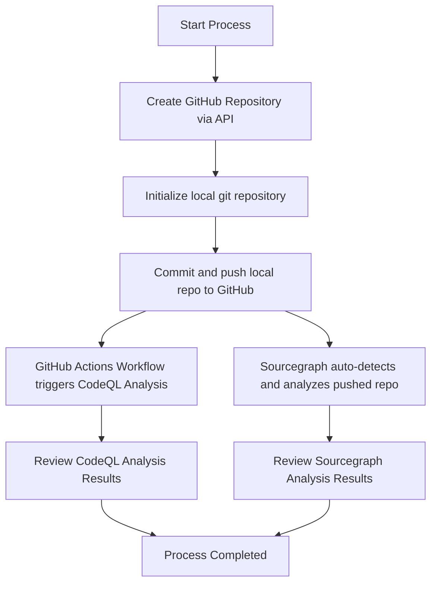

# Detailed Plan for GitHub Repository Initialization and Analysis Trigger

## Overview

This document outlines the detailed plan for:
1. Creating a new GitHub repository using the GitHub API and pushing the local repository to it.
2. Setting up and triggering CodeQL analysis via GitHub Actions.
3. Triggering Sourcegraph analysis using an existing integration.

## Steps

### 1. GitHub Repository Initialization
- **Repository Name:** `openmanus_test_repo` (using the current directory name)
- **Repository Creation:**
  - Use the configured GitHub token to authenticate requests.
  - Create a new repository via the GitHub API under your account.
- **Local Git Setup:**
  - Initialize a local git repository (if not already initialized).
  - Add all files, commit them, and push the local repository to the newly created remote repository.

### 2. Triggering CodeQL Analysis
- **Setup GitHub Actions Workflow:**
  - Create a file: ".github/workflows/codeql-analysis.yml" that configures CodeQL analysis.
  - The workflow should be triggered on pushes and pull requests.
- **CodeQL Configuration:**
  - Configure the workflow to use GitHub's official CodeQL Action for analysis.

### 3. Triggering Sourcegraph Analysis
- **Existing Integration:**
  - After pushing the repository, the Sourcegraph instance will automatically detect the changes and trigger the analysis.
  - Verify that the default branch is monitored by Sourcegraph.

## Mermaid Diagram

## Next Steps
- Execute the plan by switching to Code mode for implementation tasks.
- Monitor CodeQL and Sourcegraph analysis results as the repository is pushed.